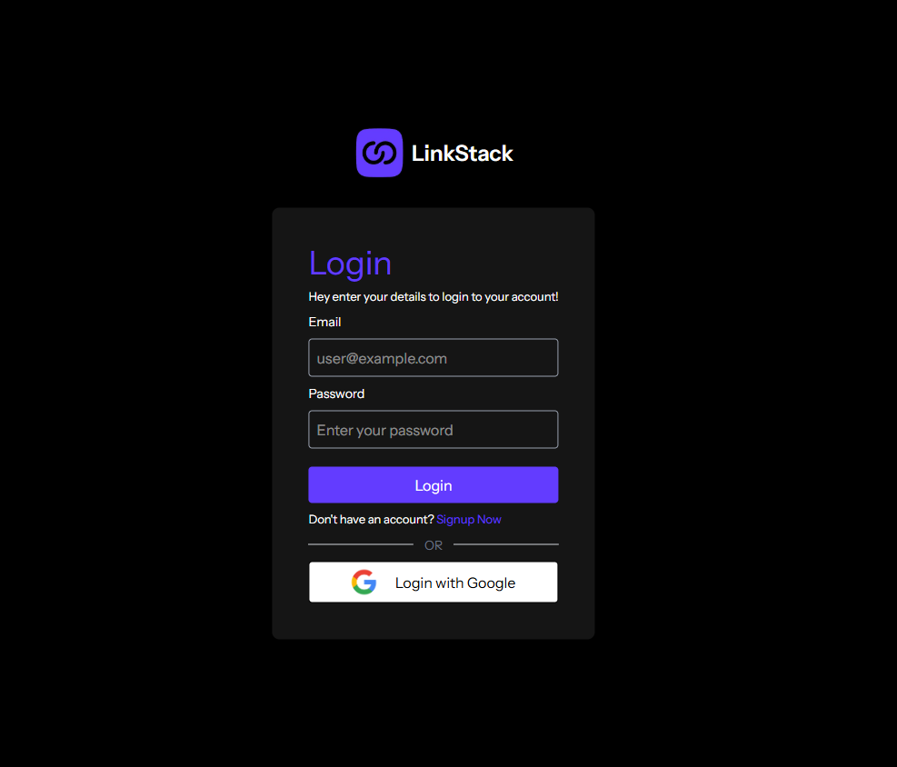
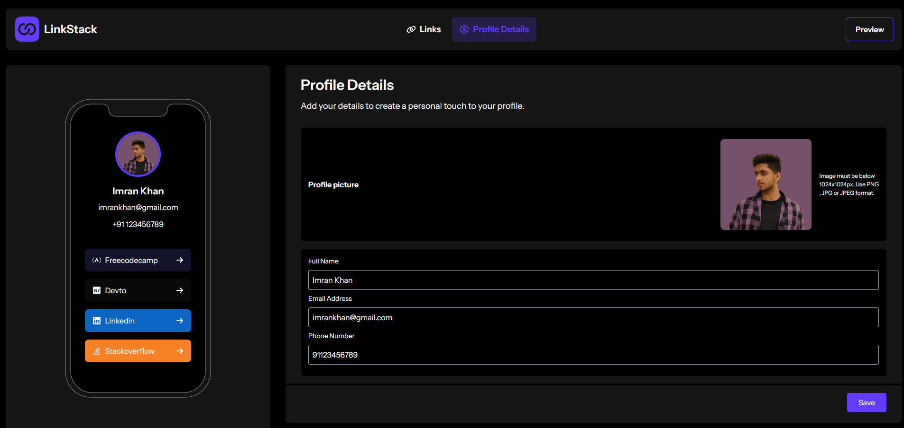
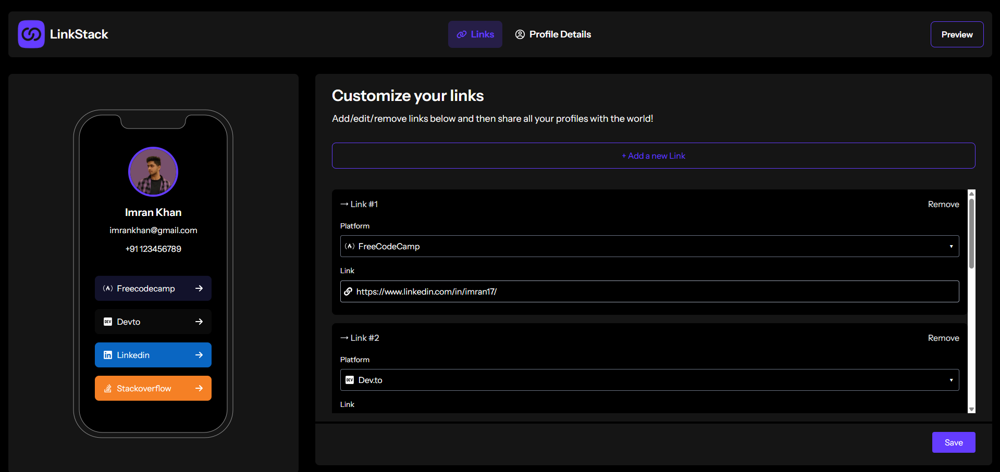
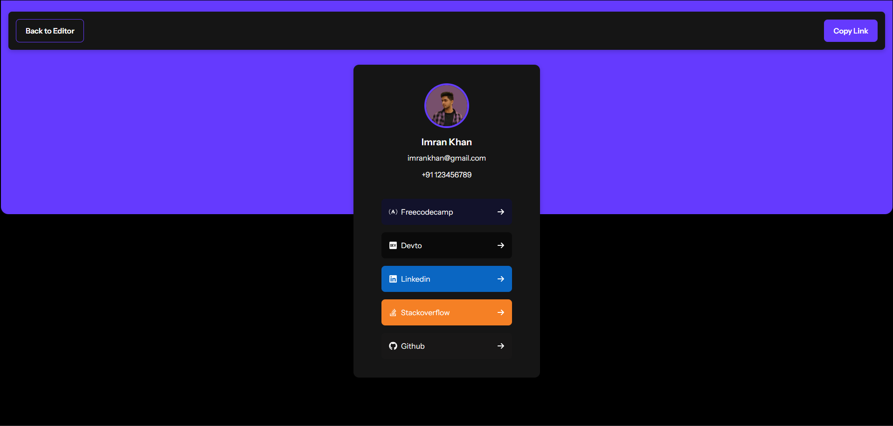

# LinkStack 🔗

A beautiful, customizable link-sharing platform to showcase all your profiles in one place with Firebase-powered authentication.

## Features ✨

- **One-Click Profile**: Share all your links with a single URL
- **Firebase Authentication**: Secure email/password and Google login
- **Cloudinary Integration**: Easy profile picture uploads
- **Instant Notifications**: React Hot Toast for smooth user feedback
- **Mobile-First Design**: Fully responsive on all devices

## Tech Stack 🛠️

**Frontend:**
- ⚛️ React.js (v18+)
- 🛣️ React Router v6
- 🎨 Tailwind CSS + CSS Modules
- ✨ React Icons
- 🍞 React Hot Toast

**Backend:**
- 🔥 Firebase (Authentication + Database)

**Media Handling:**
- ☁️ Cloudinary API (Image upload/storage)

**Deployment:**
- ▲ Vercel 

## Screenshots 📸

| Authentication | Profile Editor | Link Editor |
|---------------|----------------|-------------|
|  |  |  | 

| Mobile View | Profile Preview |
|-------------|-----------------|
| |  |

### Installation

1. Clone the repository:
   ```bash
   git clone https://github.com/imrancodes/LinkStack.git

2. Navigate to the project directory:
   ```bash
   cd LinkStack
3. Install dependencies:
   ```bash
   npm install
4. Start the development server:
   ```bash
   npm run dev

## 🌟 Contributing

We welcome contributions! Feel free to open an issue or submit a pull request.

```bash
# Create a new branch
git checkout -b feature-branch

# Commit your changes
git commit -m 'Added new feature'

# Push to GitHub
git push origin feature-branch
```

---